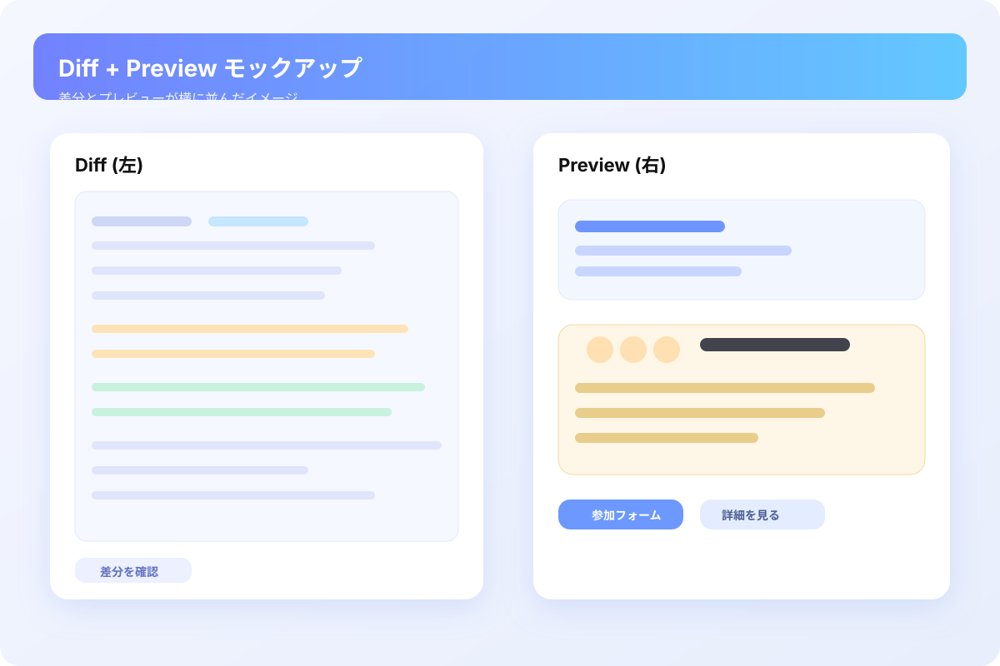

# 社内飲み会ダッシュボード モックアップ

モダンで親しみやすい飲み会告知ページのモックアップです。`index.html` と `styles.css` の静的ファイルのみで構成されています。



> Diff 側の変更と並べてプレビューを想像できるよう、簡易モックを SVG で同梱しました。差分タブ内でも画像プレビューが開けます。

## プレビュー方法

ローカルでプレビューする場合は、Node.js があればセットアップ不要でサーバーを立ち上げられます。

```bash
npm run preview
```

デフォルトで [http://localhost:4173](http://localhost:4173) が開けます。別ポートを使いたい場合は `PORT` 環境変数を指定してください。

```bash
PORT=5000 npm run preview
```

ブラウザでアクセスするとトップページが表示されます。

### Diff + Preview について

このリポジトリでは、差分（Diff）とプレビューを併用してモックアップのイメージを確認できるようにしています。変更点と実際の見た目をセットでチェックする運用を想定しています。

* Diff: PR 画面などで左側に表示される差分で、コード変更を確認します。
* Preview: `npm run preview` で立ち上がるプレビューやブラウザのプレビュー欄で、変更後の見た目を確認します。

Diff でコード差分を拾いつつ、プレビューでカードやボタンの見た目を確認してください。

### 「差分の横」にプレビューが出ない場合

GitHub や一般的な差分ビューアは、静的 HTML を自動で右側にレンダリングする仕組みを持っていません。そのため、このリポジトリでは以下の流れでプレビューを確認してください。

1. 差分（Diff）でコード変更箇所を確認する。
2. ローカルまたはプレビュー機能付きエディタ拡張で `npm run preview` を実行し、ブラウザのプレビュー欄で見た目を確認する。

一部のツール（例: VS Code 拡張の「HTML Preview」など）では、diff パネルと並べて HTML を表示できますが、リポジトリ側では自動配置できません。プレビューを同時に見たい場合は、お使いのレビュー環境でプレビュー表示をサイドバーに配置してください。

### 差分画面でプレビューを把握するために

* `preview.svg` を差分タブで開くと、コード差分の隣に並ぶプレビューイメージを視覚的に確認できます。
* 実際の動作確認は `npm run preview` で立ち上げたページをブラウザで開いてください。
* 必要に応じて、SVG をキャプチャしてレビューコメントに添付するとレビュワーも差分と見た目を同時に把握できます。

### トラブルシュート

* `git show` で初期コミットだけが見えてコードが存在しないように見える場合は、最新のブランチ（例: `work`）にいるか確認してください。現在のブランチには `index.html` / `styles.css` / `preview.js` などのモックアップ一式が含まれています。
* `preview.svg` など静的ファイルが 404 になる場合でも、`npm run preview` のサーバーがリポジトリ直下のファイルをすべて配信するように調整しています。
